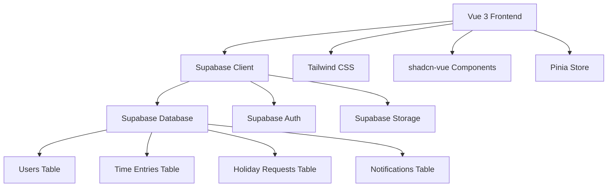
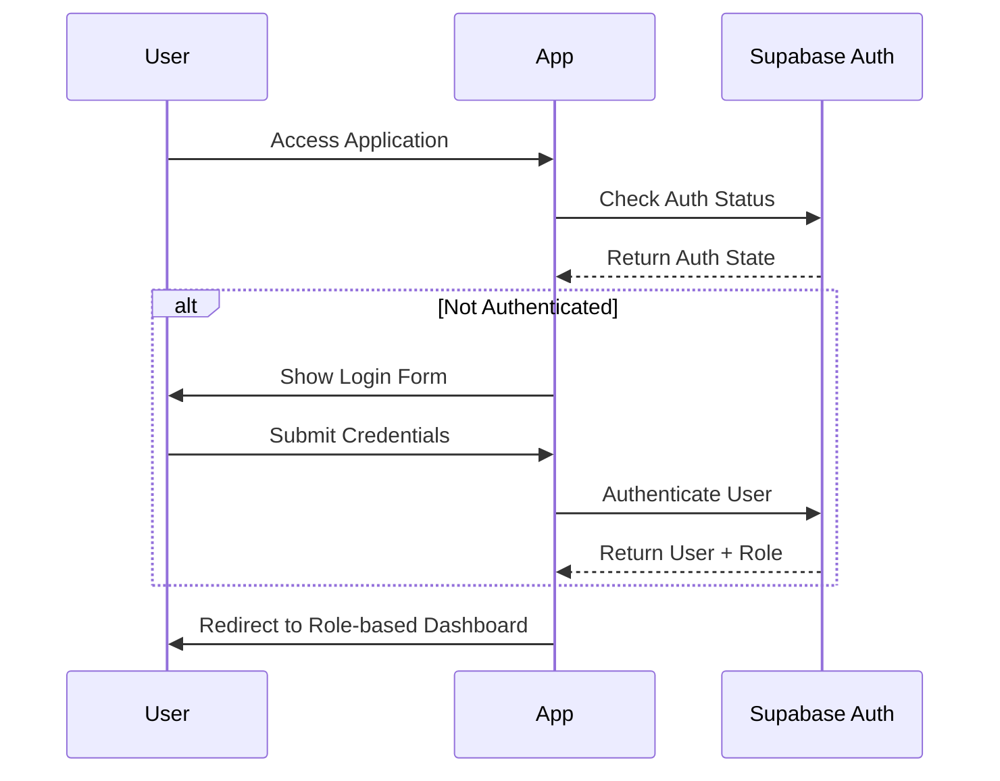

# Design Document

## Overview

ClockIn is a modern web application built with Vue 3, Tailwind CSS, shadcn-vue components, and Supabase backend. The system provides role-based interfaces for employees and administrators, focusing on time tracking, holiday management, and administrative oversight. The architecture emphasizes simplicity, modern design patterns, and efficient data management suitable for a small team (6 people) using Supabase's free tier.

## Architecture

### High-Level Architecture



### Technology Stack

- **Frontend Framework**: Vue 3 with TypeScript
- **Styling**: Tailwind CSS for utility-first styling
- **UI Components**: shadcn-vue for consistent, accessible components
- **Backend**: Supabase (Database, Authentication, Real-time subscriptions)
- **State Management**: Pinia for reactive state management
- **Routing**: Vue Router v4
- **Date Handling**: date-fns for date manipulation and formatting
- **Export Functionality**: jsPDF for PDF generation, csv-writer for CSV exports

### Authentication Flow



## Components and Interfaces

### Core Components Structure

```
src/
├── components/
│   ├── ui/                     # shadcn-vue components
│   ├── auth/
│   │   ├── LoginForm.vue
│   │   └── ProtectedRoute.vue
│   ├── employee/
│   │   ├── TimeEntryForm.vue
│   │   ├── HolidayCalendar.vue
│   │   ├── HolidayRequestModal.vue
│   │   └── NotificationBell.vue
│   ├── admin/
│   │   ├── Dashboard.vue
│   │   ├── UserCard.vue
│   │   ├── ActivityFeed.vue
│   │   ├── UserDetailView.vue
│   │   ├── ExportControls.vue
│   │   └── HolidayManagement.vue
│   └── shared/
│       ├── Layout.vue
│       ├── Navigation.vue
│       ├── SettingsPage.vue
│       ├── AvatarUpload.vue
│       └── LoadingSpinner.vue
├── composables/
│   ├── useAuth.ts
│   ├── useTimeEntries.ts
│   ├── useHolidayRequests.ts
│   ├── useNotifications.ts
│   └── useUserSettings.ts
├── stores/
│   ├── auth.ts
│   ├── timeEntries.ts
│   ├── holidayRequests.ts
│   └── notifications.ts
├── utils/
│   ├── supabase.ts
│   ├── dateHelpers.ts
│   └── exportHelpers.ts
└── types/
    └── index.ts
```

### Key Interface Definitions

```typescript
interface User {
  id: string;
  email: string;
  full_name: string;
  avatar_url?: string;
  role: 'employee' | 'admin';
  holiday_allowance: number;
  default_start_time: string;
  default_lunch_minutes: number;
  default_end_time: string;
  created_at: string;
}

interface TimeEntry {
  id: string;
  user_id: string;
  date: string;
  start_time: string;
  end_time: string;
  lunch_break_minutes: number;
  total_hours: number;
  created_at: string;
}

interface UserSettings {
  default_start_time: string;
  default_lunch_minutes: number;
  default_end_time: string;
  avatar_url?: string;
}

interface HolidayRequest {
  id: string;
  user_id: string;
  start_date: string;
  end_date: string;
  days_requested: number;
  status: 'pending' | 'approved' | 'denied';
  reason?: string;
  admin_notes?: string;
  created_at: string;
  updated_at: string;
}

interface Notification {
  id: string;
  user_id: string;
  type: 'holiday_request' | 'holiday_approved' | 'holiday_denied';
  title: string;
  message: string;
  read: boolean;
  created_at: string;
}
```

## Data Models

### Database Schema

#### Users Table
```sql
CREATE TABLE users (
  id UUID PRIMARY KEY DEFAULT gen_random_uuid(),
  email TEXT UNIQUE NOT NULL,
  full_name TEXT NOT NULL,
  avatar_url TEXT,
  role TEXT NOT NULL CHECK (role IN ('employee', 'admin')),
  holiday_allowance INTEGER DEFAULT 25,
  default_start_time TIME DEFAULT '09:00:00',
  default_lunch_minutes INTEGER DEFAULT 60,
  default_end_time TIME DEFAULT '17:00:00',
  created_at TIMESTAMP WITH TIME ZONE DEFAULT NOW()
);
```

#### Time Entries Table
```sql
CREATE TABLE time_entries (
  id UUID PRIMARY KEY DEFAULT gen_random_uuid(),
  user_id UUID REFERENCES users(id) ON DELETE CASCADE,
  date DATE NOT NULL,
  start_time TIME NOT NULL,
  end_time TIME NOT NULL,
  lunch_break_minutes INTEGER DEFAULT 0,
  total_hours DECIMAL(4,2) GENERATED ALWAYS AS (
    EXTRACT(EPOCH FROM (end_time - start_time)) / 3600 - (lunch_break_minutes / 60.0)
  ) STORED,
  created_at TIMESTAMP WITH TIME ZONE DEFAULT NOW(),
  UNIQUE(user_id, date)
);
```

#### Holiday Requests Table
```sql
CREATE TABLE holiday_requests (
  id UUID PRIMARY KEY DEFAULT gen_random_uuid(),
  user_id UUID REFERENCES users(id) ON DELETE CASCADE,
  start_date DATE NOT NULL,
  end_date DATE NOT NULL,
  days_requested INTEGER NOT NULL,
  status TEXT NOT NULL DEFAULT 'pending' CHECK (status IN ('pending', 'approved', 'denied')),
  reason TEXT,
  admin_notes TEXT,
  created_at TIMESTAMP WITH TIME ZONE DEFAULT NOW(),
  updated_at TIMESTAMP WITH TIME ZONE DEFAULT NOW()
);
```

#### Notifications Table
```sql
CREATE TABLE notifications (
  id UUID PRIMARY KEY DEFAULT gen_random_uuid(),
  user_id UUID REFERENCES users(id) ON DELETE CASCADE,
  type TEXT NOT NULL CHECK (type IN ('holiday_request', 'holiday_approved', 'holiday_denied')),
  title TEXT NOT NULL,
  message TEXT NOT NULL,
  read BOOLEAN DEFAULT FALSE,
  created_at TIMESTAMP WITH TIME ZONE DEFAULT NOW()
);
```

### Row Level Security (RLS) Policies

```sql
-- Users can only see their own data unless they're admin
CREATE POLICY "Users can view own profile" ON users
  FOR SELECT USING (auth.uid() = id OR 
    EXISTS (SELECT 1 FROM users WHERE id = auth.uid() AND role = 'admin'));

-- Time entries are private to user or visible to admins
CREATE POLICY "Time entries access" ON time_entries
  FOR ALL USING (auth.uid() = user_id OR 
    EXISTS (SELECT 1 FROM users WHERE id = auth.uid() AND role = 'admin'));

-- Holiday requests follow similar pattern
CREATE POLICY "Holiday requests access" ON holiday_requests
  FOR ALL USING (auth.uid() = user_id OR 
    EXISTS (SELECT 1 FROM users WHERE id = auth.uid() AND role = 'admin'));

-- Notifications are private to user
CREATE POLICY "Notifications access" ON notifications
  FOR ALL USING (auth.uid() = user_id);
```

## Error Handling

### Error Handling Strategy

1. **Network Errors**: Implement retry logic with exponential backoff for Supabase operations
2. **Validation Errors**: Client-side validation with clear error messages using VeeValidate
3. **Authentication Errors**: Automatic redirect to login with session restoration
4. **Database Errors**: Graceful degradation with user-friendly error messages
5. **Export Errors**: Fallback mechanisms and progress indicators

### Error Boundary Implementation

```typescript
interface ErrorBoundaryState {
  hasError: boolean;
  error?: Error;
}

class ErrorBoundary extends Component<PropsWithChildren, ErrorBoundaryState> {
  // Implementation for catching and displaying errors gracefully
}
```

### Toast Notification System

Using shadcn-vue toast component for user feedback:
- Success messages for completed actions
- Error messages for failed operations
- Loading states for async operations
- Confirmation dialogs for destructive actions

## Testing Strategy

### Testing Approach (Future Implementation)

While testing is not required for the initial implementation, the architecture supports future testing with:

1. **Unit Testing**: Jest + React Testing Library for component testing
2. **Integration Testing**: Testing user workflows and API interactions
3. **E2E Testing**: Playwright for critical user journeys
4. **Database Testing**: Supabase local development for schema testing

### Testable Architecture Patterns

- Pure functions for business logic
- Composables for data fetching logic
- Separation of concerns between UI and business logic
- Mock-friendly API layer with dependency injection

## User Experience Design

### Design System (Based on Mock)

**Color Palette:**
- Primary: Blue (#3b82f6, #2563eb, #1d4ed8) for interactive elements and branding
- Success: Green (#84fab0, #8fd3f4 gradient) for approved states
- Warning: Blue/Yellow for pending states
- Error: Red for denied/error states
- Neutral: Gray scale (50, 100, 600, 700, 900) for text and backgrounds
- Background: Light gray (#f9fafb) for main background

**Typography:**
- Font Family: Inter (300, 400, 500, 600, 700 weights)
- Headings: Font-semibold to font-bold
- Body text: Regular weight with consistent line heights
- Consistent spacing using Tailwind's spacing scale

**Component Patterns:**
- **Navigation**: Clean top navigation with logo, notifications, and user profile
- **Cards**: White background with subtle shadows and rounded corners (rounded-xl)
- **Employee Time Entry**: Large card with 3-field form (start time, lunch minutes, end time)
- **Admin User Cards**: Grid layout with avatar, name, role, and quick stats
- **Activity Feed**: Timeline-style notifications with icons and action buttons
- **Modals**: Centered overlay with backdrop blur for holiday requests
- **Notifications**: Dropdown panel with color-coded notification types

**Layout Structure:**
- **Employee View**: 
  - Welcome header with user greeting
  - Main time entry card (2/3 width) + quick stats sidebar (1/3 width)
  - Full-width holiday calendar below
- **Admin View**:
  - Team overview header
  - User cards grid (2/3 width) + activity feed sidebar (1/3 width)
  - Export controls integrated in sidebar

**Interactive Elements:**
- Hover effects with scale transforms (hover-scale)
- Smooth color transitions on buttons and links
- Status badges with appropriate colors (green=active, yellow=on holiday)
- Auto-calculation of total hours in time entry form

**Visual Hierarchy:**
- Clear section headers with consistent typography
- Proper spacing between elements
- Color-coded status indicators
- Icon usage for visual context (FontAwesome icons)

### Responsive Design

- Mobile-first approach using Tailwind breakpoints
- Collapsible navigation for mobile devices
- Touch-friendly interactive elements
- Optimized layouts for tablet and desktop

### Accessibility

- WCAG 2.1 AA compliance through shadcn/ui components
- Keyboard navigation support
- Screen reader compatibility
- High contrast mode support
- Focus management for modals and forms

## Performance Considerations

### Optimization Strategies

1. **Code Splitting**: Route-based code splitting with React.lazy()
2. **Data Fetching**: Efficient queries with Supabase's built-in caching
3. **State Management**: Minimal re-renders through proper context usage
4. **Image Optimization**: Lazy loading for user avatars
5. **Bundle Size**: Tree shaking and minimal dependencies

### Supabase Free Tier Optimization

- Efficient database queries to minimize API calls
- Real-time subscriptions only where necessary
- Optimized storage usage for user avatars
- Connection pooling through Supabase client configuration

## Security Considerations

### Data Protection

1. **Authentication**: Supabase Auth with secure session management
2. **Authorization**: Row Level Security policies for data access
3. **Input Validation**: Client and server-side validation
4. **XSS Prevention**: Proper data sanitization
5. **CSRF Protection**: Built-in protection through Supabase

### Privacy

- Minimal data collection
- Secure handling of personal information
- GDPR-compliant data practices
- User consent for data processing